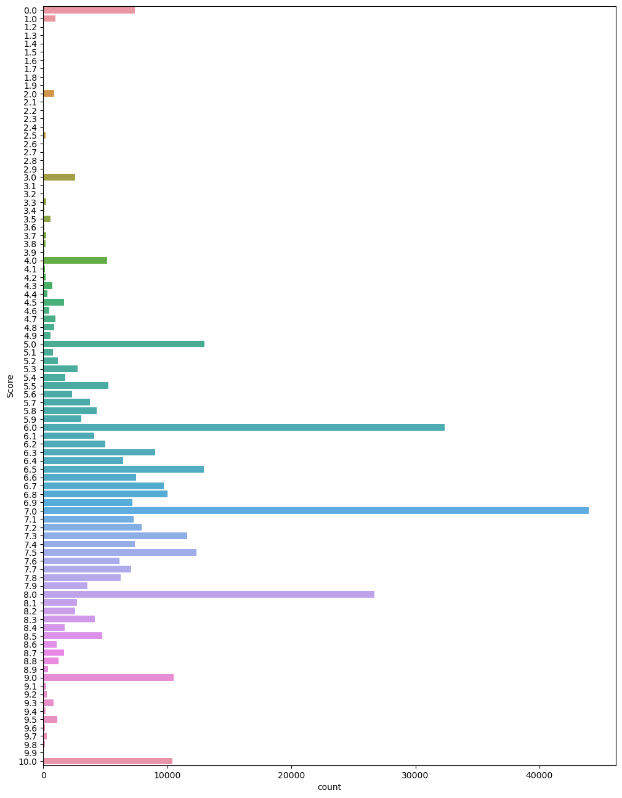

# Book Information and Reviews Scrape

## Project Description

This project consists of massive (over 300,000 rows) book information and user review dataset, it was made to learn user review preferences and answer questions like: Is this number a high review?

## Libraries and Technologies Used

The following libraries and technologies are used in this project:

- BeautifulSoup
- pandas
- NumPy
- seaborn

## Score Count

Graph bellow quite clearly shows preferences for reviews, 0 and 10 are caused by a low number of reviews for some books.

